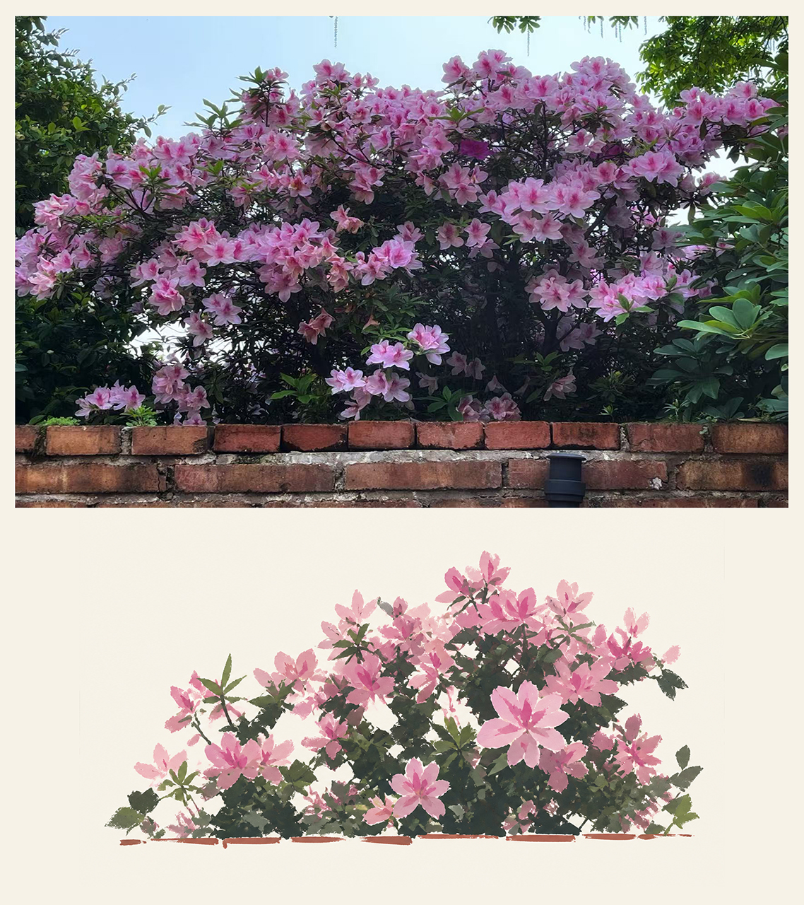
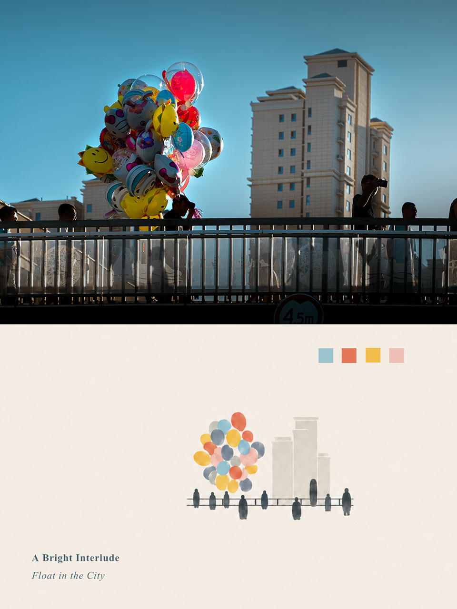
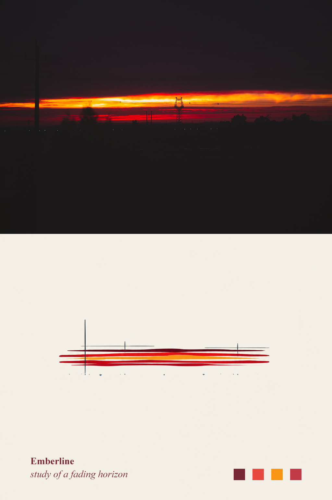
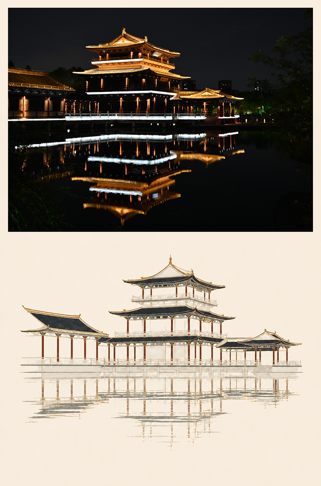
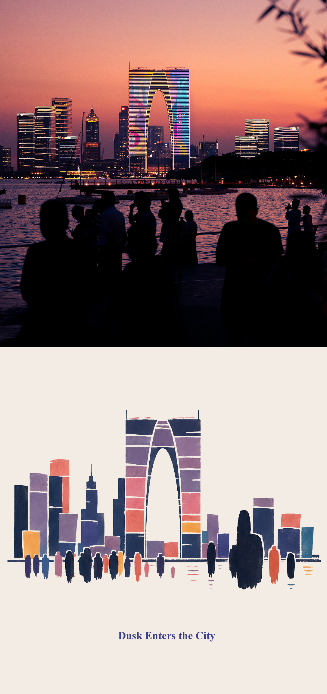

<div align="center">

# 🎨 Photo Abstract Editorial

**将一张照片转化为「原始摄影区域 + 抽象记忆面板 + 诗意英文标题」的竖向编辑作品**

[](https://github.com/ArnoChanPolimi/photo-abstract-editorial)
[](#方式三运行本地网页应用)
[](./LICENSE.md)
[](#)

### [📖 安装并启动](#方式三运行本地网页应用) · [🌐 打开本地界面](http://127.0.0.1:7860)

> “打开本地界面”需要先按下方说明启动应用。当前版本不会自动部署到公网。

</div>

---

## ⚠️ 声明

> **Free for personal, educational and non-commercial use.**
> Commercial use is not allowed.
>
> If you build something with these Skills, attribution and **@AM.** are greatly appreciated.

<details>
<summary>💬 作者的话</summary>

在这里吐槽一下，真的很无语这几天，被人抄袭，甚至有人拿这个东西去卖，我真的无语！

</details>

---

## 📖 关于本项目

本项目现在包含两个互相配合的部分：

1. **Codex Skill**：保留完整的中英文生成方法与审美约束。
2. **本地 Gradio 网页应用**：普通用户无需编写 prompt，即可上传图片、选择多个风格与格式、批量生成并下载结果。

它们都能将一张照片转化为「原始摄影区域 + 抽象记忆面板 + 诗意英文标题」的竖向编辑作品，或仅输出独立抽象面板。

- ✅ 保留照片的**真实内容**
- ✅ 仅从照片本身提炼**空间关系、构图节奏和色彩关系**
- ❌ 不是滤镜、照片重画或风格迁移

> 📝 The skill includes the complete prompt in both **Chinese** and **English**.

---

## 🖼️ 示例作品

> 原图均为本人拍摄

<p align="center">
  
  
  
  <br><br>
  
  
  
</p>

---

## 📋 目录

- [使用方法](#-使用方法)
- [可自由调整的部分](#-可自由调整的部分)
- [核心原则](#-核心原则)
- [内容结构](#-内容结构)
- [许可证](#-许可证)

---

## 🚀 使用方法

### 方式一：作为 Codex Skill 使用

1. 将整个 `photo-abstract-editorial` 文件夹复制到你的 Codex skills 目录，例如 `~/.codex/skills/`
2. 开启新的 Codex 对话，上传一张希望处理的照片
3. 直接提出需求，例如：

   > 使用 `photo-abstract-editorial` 将这张照片制作成摄影与抽象面板组合的编辑作品。

4. Skill 会将原图保留在成品的上方或主要区域，并在下方创建由原图关系推导出的极简抽象面板。成品中只保留一个原创英文标题（可选副标题）。

### 方式二：作为提示词直接使用

也可以直接打开下列文件，并将其作为图像生成提示词使用：

| 语言 | 文件 |
| :---: | :--- |
| 🇨🇳 中文 | [references/photo-abstract-editorial-prompt.zh-CN.md](references/photo-abstract-editorial-prompt.zh-CN.md) |
| 🇬🇧 English | [references/photo-abstract-editorial-prompt.en.md](references/photo-abstract-editorial-prompt.en.md) |

### 方式三：运行本地网页应用

要求：Windows、Python 3.10 或更新版本。当前版本仅本地运行，不做公开部署，也不需要 API key。

```powershell
git clone https://github.com/ArnoChanPolimi/photo-abstract-editorial.git
cd photo-abstract-editorial
python -m venv .venv
.\.venv\Scripts\python.exe -m pip install -r requirements.txt
.\.venv\Scripts\python.exe -m app.app
```

也可以双击 `run.bat`。浏览器默认打开 [http://127.0.0.1:7860](http://127.0.0.1:7860)。如需改变本地地址或端口，可复制 `.env.example` 的变量到当前 shell 环境；应用读取 `PAE_HOST` 和 `PAE_PORT`。

网页支持：

- 点击上传、拖拽上传或粘贴图片；也可输入完整本地图片路径。
- 同时提供上传和路径时，**上传图片优先**，界面会明确提示。
- 单选或多选六种稳定风格：Classic Editorial、Minimal、Travel / Architecture、Soft Memory、Bold Graphic、Museum Poster。
- 输出模式：Composed Editorial、Abstract Panel Only、Both。
- 输出格式可多选：PNG、JPEG、WEBP、PDF。
- Auto / None / Custom 标题，Low / Medium / High 抽象程度，以及独立画布比例和透明背景选项。
- 结果 Gallery、单文件下载及全部结果 ZIP 下载。

每个任务保存在 `outputs/<时间戳-任务ID>/<输入文件名>/`。文件名采用：

```text
<输入名>__<风格>__<composed|abstract>.<格式>
```

每个结果 PDF 为单页；当一次任务包含多个结果且选择 PDF 时，会额外生成 `all-results.pdf` 多页汇总文件。`manifest.json` 保存任务设置、照片分析摘要与 preset 参数，ZIP 包含全部正式导出文件和 manifest。

#### 本地生成架构与权衡

- 原照片经 EXIF 方向校正和高质量等比缩放后由 Pillow 直接拼接，生成器不会重画照片区域。
- 抽象面板由 NumPy 提取色彩、亮度、对比度与主要水平/垂直结构，再由 preset 驱动的 Pillow 图元确定性绘制；同一照片和风格会得到稳定倾向，而不是随机重复调用。
- 第一版不调用图像模型，因此无需 API key、隐私更简单、批量输出可预测；代价是语义理解和抽象表现力低于完整的 AI/Codex 工作流。后续可在不改变 compositor 的前提下增加可选 AI 面板生成器。
- 完整作品中的照片始终是位图。网页当前导出 PNG/JPEG/WEBP/PDF；Skill 对话工作流仍可按 `references/output-formats.md` 生成独立真矢量 SVG/PDF 母题。

---

## 🎛️ 可自由调整的部分

这套提示词应当被视为**高质量起点**，而不是不可变的版式规范。请按自己的审美和项目需求修改以下参数：

| 参数 | 说明 |
| :--- | :--- |
| **📐 照片与面板的比例** | 可调整摄影区域和抽象面板的高度占比、画布比例，以及抽象母题的大小与留白 |
| **🎨 颜色** | 可修改象牙色面板背景、照片提取色的饱和度、主色与强调色的数量和倾向 |
| **✏️ 抽象形式** | 可选择或混合色块、柔和有机质量、弧形笔触、短条、层叠色带、简化建筑质量、细线、点状标记等形式 |
| **📝 版式与文字** | 可调整母题位置、标题位置、字体气质、标题长度和是否使用副标题 |
| **🔍 抽象程度** | 可根据题材在「关系优先」和「保留少量身份特征」之间调整，例如让地标建筑或小型物件保留更多辨识线索 |

---

## 💡 核心原则

调整时建议保留两条核心原则：

1. **上传照片始终是唯一内容来源** — 照片区域不应被重画、扩展或改写
2. **抽象面板可追溯** — 每个重要元素都应能追溯到原照片中真实存在的空间、色彩或结构事实

---

## 📁 内容结构

```text
photo-abstract-editorial/
├── SKILL.md                         # Skill 工作流程与约束
├── agents/openai.yaml               # Codex 界面元数据
├── references/
│   ├── photo-abstract-editorial-prompt.zh-CN.md
│   ├── photo-abstract-editorial-prompt.en.md
│   └── output-formats.md
├── app/
│   ├── app.py                       # 启动入口
│   ├── ui.py                        # Gradio 界面
│   ├── style_presets.py             # 六种结构化 preset
│   ├── analyzer.py                  # 色彩与结构分析
│   ├── compositor.py                # 抽象绘制与原图拼接
│   ├── exporters.py                 # PNG/JPEG/WEBP/PDF/ZIP
│   ├── generator.py                 # 任务编排
│   ├── skill_loader.py              # Skill 与提示词加载
│   └── utils.py                     # 路径、任务 ID 等工具
├── tests/test_pipeline.py           # 端到端管线测试
├── outputs/                         # 每次任务一个目录
├── requirements.txt
├── .env.example
├── run.bat
└── assets/examples/                 # 示例图片
```

> ⚠️ `assets/examples` 中的图片仅用于理解预期输入类型；除非用户上传该图片本身，否则不要将其中的主题、色彩或构图复用于新的作品。

---

## 📄 许可证

本项目采用 [LICENSE.md](./LICENSE.md) 中规定的许可证。

---

<div align="center">

**如果这个项目对你有帮助，欢迎 Star ⭐ 支持！**

</div>
请作者充点Token（coffee）
<p align="center">
  
  
</p>
<!-- 
## 声明
Free for personal, educational and non-commercial use. Commercial use requires prior authorization. If you build something with these Skills, attribution and @AM. are greatly appreciated.

商业授权已不被允许，请不要私自商用，谢谢！
douyin: 12919593  xiaohongshu: Cclz_9

在这里吐槽一下，真的很无语这几天，被人抄袭，甚至有人拿这个东西去卖，我真的无语！

# Photo Abstract Editorial

将一张照片转化为“原始摄影区域 + 抽象记忆面板 + 诗意英文标题”的竖向编辑作品的 Codex Skill。它保留照片的真实内容，并仅从照片本身提炼空间关系、构图节奏和色彩关系；它不是滤镜、照片重画或风格迁移。

The skill includes the complete prompt in both Chinese and English.

## 示例图片（原图均为本人拍摄）

<table>
  <tr>
    <td></td>
    <td></td>
    <td></td>
  </tr>
  <tr>
    <td></td>
    <td></td>
    <td></td>
   
  </tr>
</table> 
<p align="center">
  
  
  
  <br>
  
  
  
</p>
## 使用方法

1. 将整个 `photo-abstract-editorial` 文件夹复制到你的 Codex skills 目录，例如 `~/.codex/skills/`。
2. 开启新的 Codex 对话，上传一张希望处理的照片。
3. 直接提出需求，例如：

   > 使用 `photo-abstract-editorial` 将这张照片制作成摄影与抽象面板组合的编辑作品。

4. Skill 会将原图保留在成品的上方或主要区域，并在下方创建由原图关系推导出的极简抽象面板。成品中只保留一个原创英文标题（可选副标题）。

也可以直接打开下列文件，并将其作为图像生成提示词使用：

- 中文版：[references/photo-abstract-editorial-prompt.zh-CN.md](references/photo-abstract-editorial-prompt.zh-CN.md)
- English version: [references/photo-abstract-editorial-prompt.en.md](references/photo-abstract-editorial-prompt.en.md)

## 可自由调整的部分

这套提示词应当被视为高质量起点，而不是不可变的版式规范。请按自己的审美和项目需求修改以下参数：

- **照片与面板的比例**：可调整摄影区域和抽象面板的高度占比、画布比例，以及抽象母题的大小与留白。
- **颜色**：可修改象牙色面板背景、照片提取色的饱和度、主色与强调色的数量和倾向。
- **抽象形式**：可选择或混合色块、柔和有机质量、弧形笔触、短条、层叠色带、简化建筑质量、细线、点状标记等形式。
- **版式与文字**：可调整母题位置、标题位置、字体气质、标题长度和是否使用副标题。
- **抽象程度**：可根据题材在“关系优先”和“保留少量身份特征”之间调整，例如让地标建筑或小型物件保留更多辨识线索。

调整时建议保留两条核心原则：

1. 上传照片始终是唯一内容来源，照片区域不应被重画、扩展或改写。
2. 抽象面板中的每个重要元素都应能追溯到原照片中真实存在的空间、色彩或结构事实。

## 内容结构

```text
photo-abstract-editorial/
├── SKILL.md                         # Skill 工作流程与约束
├── agents/openai.yaml               # Codex 界面元数据
├── references/
│   ├── photo-abstract-editorial-prompt.zh-CN.md
│   └── photo-abstract-editorial-prompt.en.md
└── assets/examples/                 # 5 张示例图片
```

`assets/examples` 中的图片仅用于理解预期输入类型；除非用户上传该图片本身，否则不要将其中的主题、色彩或构图复用于新的作品。
-->
